# CoinMarketCap Data Pipeline

[](https://github.com/hmatinnn/cmc-crypto-market-data-pipeline/actions/workflows/ci.yml)


An end-to-end **ELT data platform** that ingests cryptocurrency market data from the [CoinMarketCap Pro API](https://coinmarketcap.com/api/), lands it in a PostgreSQL data warehouse following the **medallion architecture**, models it into a **star schema with dbt**, validates it with **Soda**, and serves it through **Apache Superset** dashboards — all orchestrated by **Apache Airflow** and fully containerized with **Docker Compose**. Deployed on a Linux (Ubuntu) VPS with a **GitHub Actions CI/CD** pipeline.

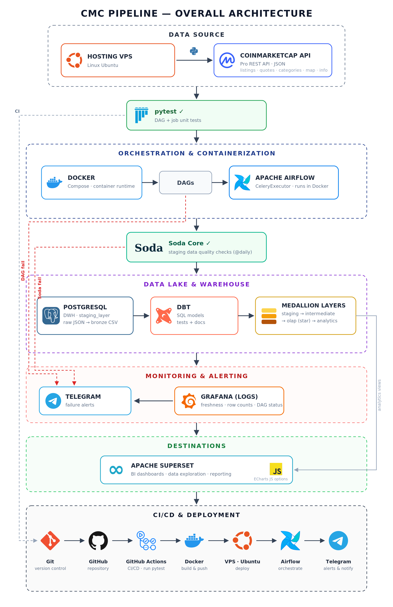

---

## Table of Contents

- [Why this design](#why-this-design)
- [Architecture](#architecture)
- [Data Source](#data-source)
- [Pipeline Flow (ELT)](#pipeline-flow-elt)
- [Warehouse Modeling](#warehouse-modeling)
- [Data Quality](#data-quality)
- [Monitoring & Alerting](#monitoring--alerting)
- [BI & Analytics](#bi--analytics)
- [Testing](#testing)
- [CI/CD & Deployment](#cicd--deployment)
- [Project Structure](#project-structure)
- [Getting Started](#getting-started)
- [Tech Stack](#tech-stack)

---

## Screenshots

### Orchestration — Airflow

15 DAGs across three cadences (daily / weekly / monthly), each split into `fetch → parse → load`, followed by the dbt and data-quality pipelines.

| Daily listings & quotes chain | Weekly categories + monthly map-info chains |
|---|---|
| 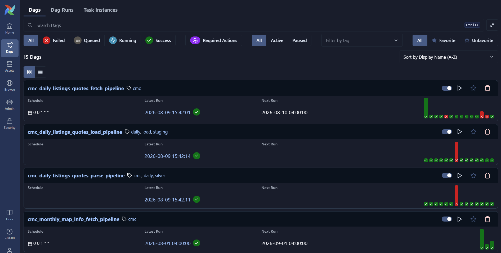 | 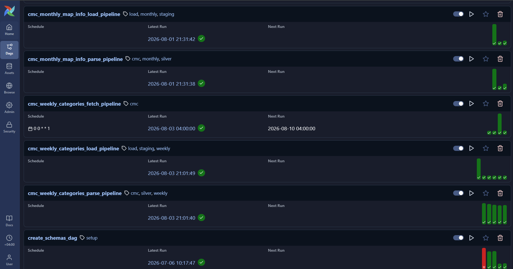 |

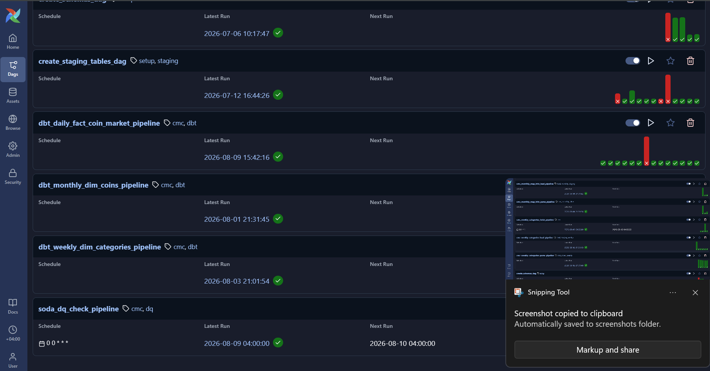

*dbt transformation DAGs (`dbt_daily_fact_coin_market_pipeline`, `dbt_monthly_dim_coins_pipeline`, `dbt_weekly_dim_categories_pipeline`) and the Soda data-quality check running on the daily schedule.*

### Analytics — Superset

`CMC Cripto Dashboard` — four tabs served straight off the dbt marts.

| Market Overview | Sectors |
|---|---|
| 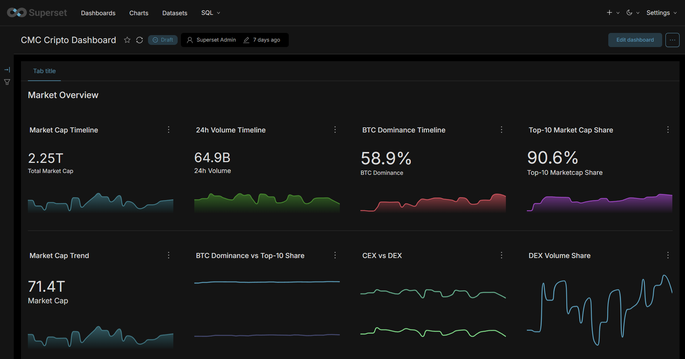 | 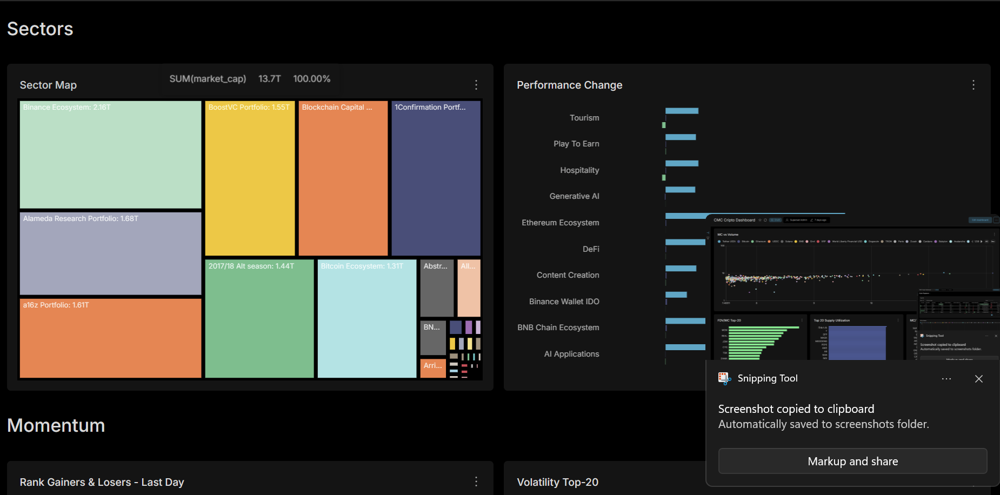 |
| Total market cap, 24h volume, BTC dominance, top-10 share | Sector treemap by market cap and per-sector performance change |

| Momentum | Coin Explorer |
|---|---|
| 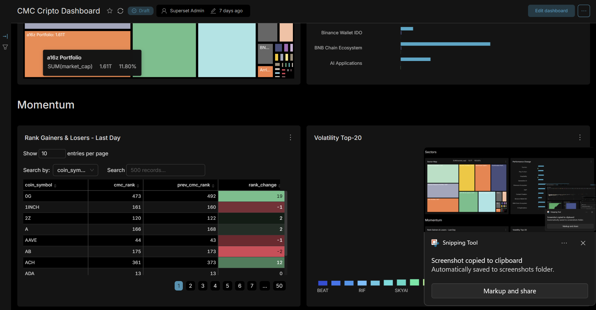 | 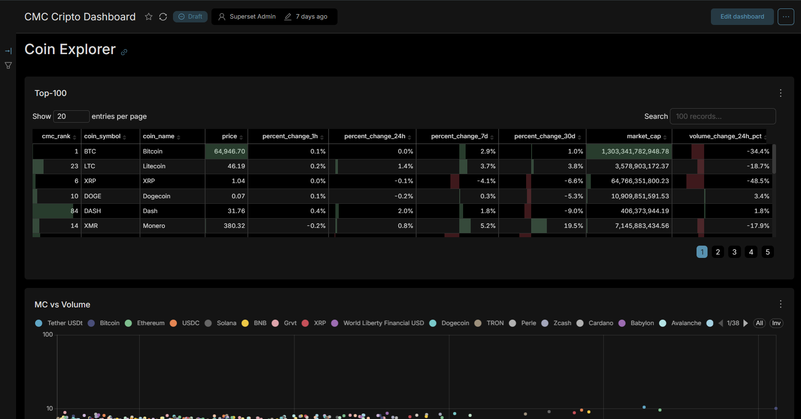 |
| Rank gainers & losers over the last day, volatility top-20 | Top-100 table with 1h/24h/7d/30d change, market cap and volume |

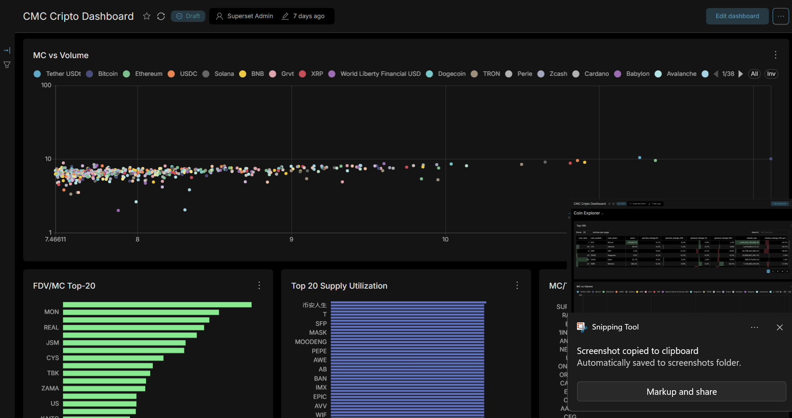

*Market cap vs. volume scatter, FDV/MC ratio and supply-utilisation panels from the Coin Explorer tab.*

### Monitoring — Grafana

A single `Monitoring` dashboard fed by the warehouse itself — every panel is a SQL query over the loaded tables, so the pipeline is observed from its own output.

| Freshness & duplicates | Completeness & load volume |
|---|---|
| 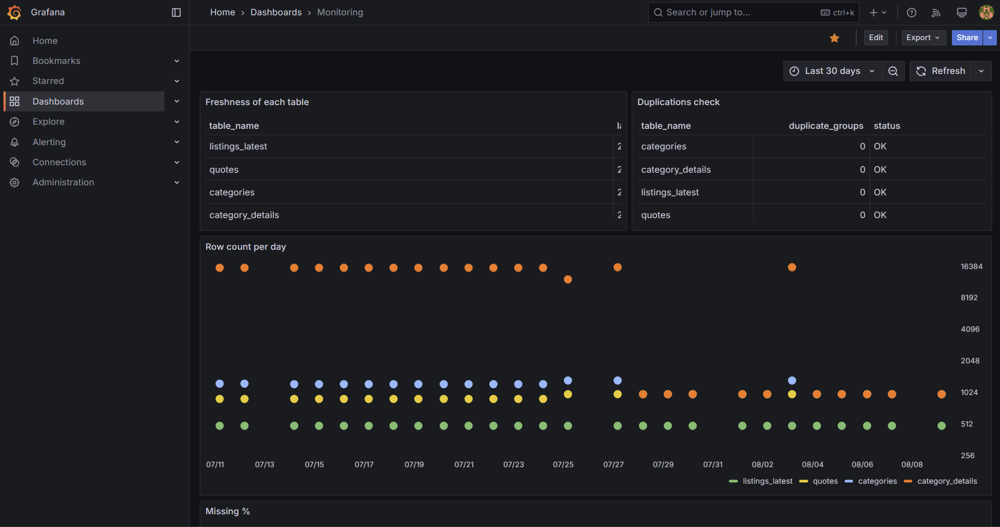 | 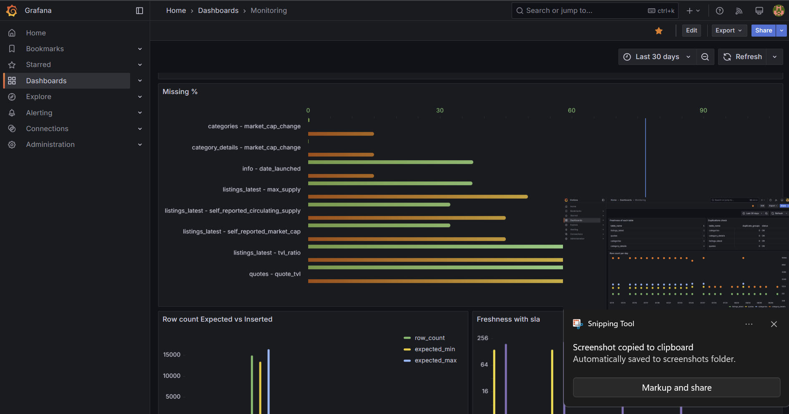 |
| Per-table freshness, duplicate-group check, row count per day | Missing-% per column, row count expected vs. inserted, freshness SLA |

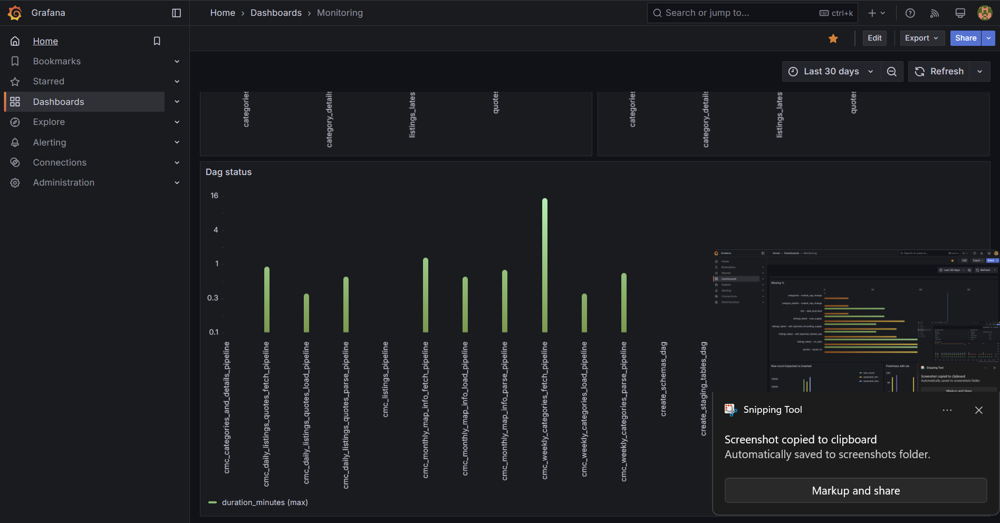

*Per-DAG max run duration — the weekly categories fetch is the long pole at ~16 minutes.*

### CI/CD

| CI — lint, tests, security | CD — deploy to server |
|---|---|
| 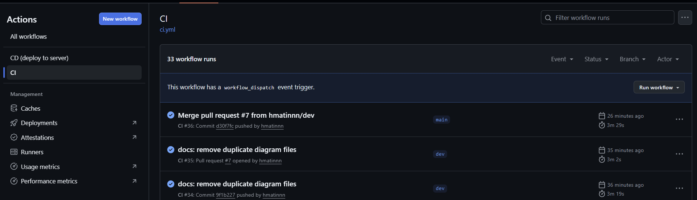 | 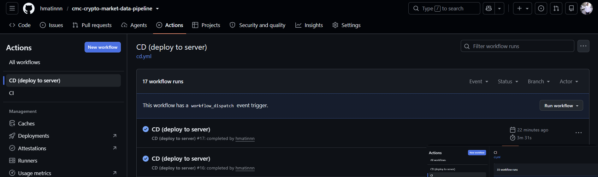 |

---

## Why this design

**ELT over ETL.** Raw API responses are landed first (as JSON, then CSV, then staging tables) and transformed *inside* the warehouse with dbt. This keeps every historical payload replayable: if a transformation rule changes, we re-run dbt models instead of re-calling the API (which is rate-limited and paid).

**Medallion architecture.** Each layer has a single responsibility, so bugs are isolated to one stage and any layer can be rebuilt from the one before it:

| Layer | Storage | Purpose |
|---|---|---|
| Bronze | `api_responses/` (raw JSON) | Exact copy of API responses — the immutable source of truth |
| Silver | `api_responses_csv/` (CSV) | Flattened, normalized, tabular; `inserted_at` audit column added |
| Staging | Postgres `staging_layer` | Typed, queryable landing tables (append-only history) |
| Gold | Postgres `olap` / `analytics` | dbt-built star schema + BI-ready views |

**Decoupled DAGs chained by triggers.** Fetch, parse, load, and dbt run as *separate* Airflow DAGs connected with `TriggerDagRunOperator` (`wait_for_completion=True`). Each stage can be re-run independently after a failure without repeating upstream work (e.g. re-load a CSV without re-calling the API).

**Cadence-based scheduling.** API endpoints are grouped by how fast their data changes, minimizing API credit usage:

| Cadence | Schedule | Endpoints | Reason |
|---|---|---|---|
| Daily | `@daily` | `listings/latest`, `quotes/latest` | Prices/volumes change constantly |
| Weekly | Mon 00:00 | `categories`, `category` (details) | Sector composition changes slowly |
| Monthly | `@monthly` | `map`, `info` | Coin metadata is near-static |

---

## Architecture

Detailed ELT process view:

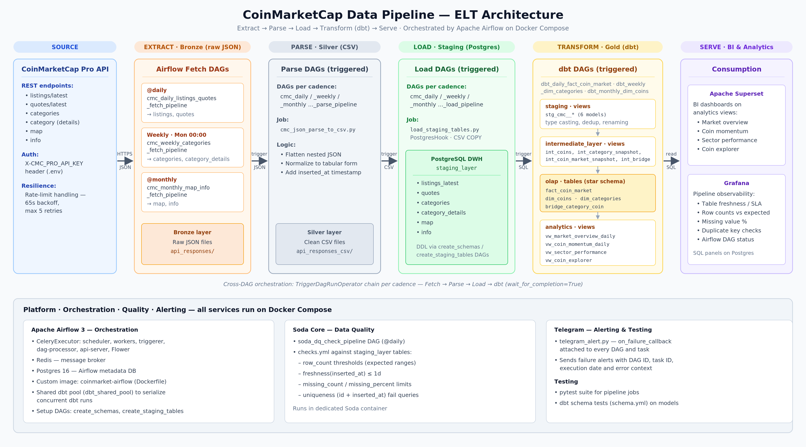

**Runtime (all in Docker Compose):**

- **Airflow 3** with **CeleryExecutor** — api-server, scheduler, dag-processor, worker, triggerer, Flower; **Redis** as the message broker and **Postgres 16** as the metadata DB. Custom image (`coinmarket-airflow`) bakes in project dependencies.
- **Postgres 16** — the data warehouse (`staging_layer`, `intermediate_layer`, `olap`, `analytics` schemas).
- **dbt** and **Soda** run in dedicated containers.
- **Superset** (with its own Postgres) and **Grafana** for serving.

A shared Airflow pool (`dbt_shared_pool`) serializes concurrent dbt runs so daily/weekly/monthly pipelines never collide on the same models.

---

## Data Source

**CoinMarketCap Pro API** — authenticated via `X-CMC_PRO_API_KEY` header (stored in `.env`, never committed).

The API client (`jobs/cmc_api_pull.py`) implements **rate-limit resilience**: on HTTP 429 it backs off for 65 seconds and retries up to 5 times, so a burst of requests never kills a DAG run.

---

## Pipeline Flow (ELT)

For each cadence group the same 4-stage chain runs:

```
fetch  ──trigger──►  parse  ──trigger──►  load  ──trigger──►  dbt
(API → raw JSON)     (JSON → CSV)         (CSV → staging)     (staging → star schema)
```

1. **Fetch** (`cmc_*_fetch_pipeline`) — calls the API, writes raw JSON to `api_responses/` (Bronze).
2. **Parse** (`cmc_*_parse_pipeline`) — `jobs/cmc_json_parse_to_csv.py` flattens nested JSON into tabular CSVs in `api_responses_csv/` (Silver), stamping every row with `inserted_at`.
3. **Load** (`cmc_*_load_pipeline`) — `jobs/load_staging_tables.py` bulk-loads CSVs into `staging_layer` tables (`listings_latest`, `quotes`, `categories`, `category_details`, `map`, `info`) via Airflow's `PostgresHook`.
4. **Transform** (`dbt_*_pipeline`) — runs the dbt project. Each cadence writes to its own dbt `target_path` (`target_daily` / `target_weekly` / `target_monthly`) so artifacts never clash.

Setup DAGs (`create_schemas_dag`, `create_staging_tables_dag`) provision the warehouse DDL idempotently (`CREATE ... IF NOT EXISTS`), so the whole platform can be rebuilt from scratch.

---

## Warehouse Modeling

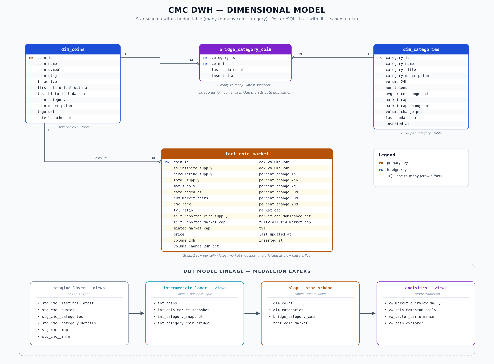

dbt models flow through three internal stages:

- **`staging` (views, `stg_cmc__*`)** — 1:1 with source tables; type casting, deduplication, column renaming. Views because they're cheap and always fresh.
- **`intermediate_layer` (views, `int_*`)** — joins and business logic (e.g. merging `listings_latest` + `quotes` into one market snapshot).
- **`olap` (tables)** — the **star schema**:
  - `fact_coin_market` — one row per coin, latest market snapshot (price, volume, market cap, supply, % changes). Materialized as a **view** on purpose: fact data changes every run, and a table went stale between runs — a view is always live.
  - `dim_coins` — one row per coin, descriptive/static attributes. A **table**, so BI tools query it without recomputing the join chain.
  - `dim_categories` — one row per category (sector).
  - `bridge_category_coin` — resolves the **many-to-many** between coins and categories without duplicating attributes into either dimension.
- **`analytics` (views, `vw_*`)** — BI-ready, pre-joined views consumed directly by Superset: `vw_market_overview_daily`, `vw_coin_momentum_daily`, `vw_sector_performance`, `vw_coin_explorer`.

Historical trend queries go against the append-only `staging_layer` (which keeps every run), while the star schema answers "current state" questions fast.

---

## Data Quality

**Soda Core** runs as a daily Airflow DAG (`soda_dq_check_pipeline`) against `staging_layer`, with checks defined declaratively in `soda/checks.yml`:

- `row_count` thresholds (including expected ranges for weekly loads)
- `freshness(inserted_at) <= 1d` — catches silently stalled pipelines
- `missing_count` / `missing_percent` limits on critical columns
- uniqueness checks (`id + inserted_at`) via fail queries — catches duplicate loads
- sanity bounds (`min(volume) >= 0`, `min(market_cap) >= 0`)

Checks run against the *latest* snapshot using a filter on `MAX(inserted_at)`, so old data never masks a bad new load. A failed scan fails the DAG → Telegram alert.

Additionally, **dbt schema tests** (`schema.yml`) validate model-level constraints after every transform.

---

## Monitoring & Alerting

- **Telegram** — every DAG and task carries an `on_failure_callback` (`jobs/telegram_alert.py`) that posts the DAG id, task id, and error context to a Telegram chat. Failures are known in seconds, not at the next manual check.
- **Grafana** — SQL panels over the warehouse and Airflow metadata DB (`grafana/*.sql`): table freshness vs SLA, row count per day vs expected, missing value %, duplicate key checks, DAG run status.

---

## BI & Analytics

**Apache Superset** connects to the `analytics` schema and serves dashboards for market overview, coin momentum, sector performance, and a coin explorer (spec in `superset/dashboard_spec.md`). Superset runs with its own metadata Postgres and a custom image (`superset/`).

---

## Testing

- **pytest** (`pytest/`) — unit tests for the API client and parsing jobs (`test_cmc_api_pull.py`), run locally and in CI.
- **dbt tests** — schema/data tests on staging and olap models.
- **Soda** — production data quality gate (see above).

---

## CI/CD & Deployment

```
feature/* ──PR──► dev ──PR──► main ──► Ubuntu VPS
              │          │        │
              │          │        └── CD: SSH deploy, docker compose up -d
              └── CI ────┘
```

### CI — six parallel jobs on every push and pull request

| Job | What it verifies | Typical runtime |
|---|---|---|
| **Lint (ruff)** | Syntax errors, undefined names, dead imports. Also blocks CRLF line endings and missing executable bits — the project is developed on Windows but runs on Linux. | ~10s |
| **Unit tests (pytest)** | 39 tests against a mocked CoinMarketCap client: request building, rate-limit retries, pagination, error paths, CLI dispatch. | ~30s |
| **dbt parse & compile** | Spins up an ephemeral Postgres and compiles every model, so a broken `ref()`, malformed YAML or Jinja error never reaches `main`. | ~50s |
| **Docker build & DAG import** | Builds all three images (airflow, dbt, soda), then parses every DAG *inside the real Airflow image* via `DagBag` — catching import errors that only surface at runtime. | ~3.5m |
| **Secret scan** | `gitleaks` over the full git history, plus a hard check that `.env` is never tracked. | ~8s |
| **CI OK** | Aggregation gate — the single required status check for branch protection. | ~5s |

> The secret scan earned its place on day one: it found three Airflow secrets
> (`fernet_key`, `secret_key`, `jwt_secret`) that had been committed inside a
> generated `config/airflow.cfg`. The file was purged from history, the keys were
> rotated, and the path is now gitignored.

### CD — deploy on merge to `main`

`deploy/deploy.sh` runs on the VPS over SSH and is written to be safe to re-run:

- refuses to start if `.env` is missing, and strips CRLF from it (a `.env` copied from Windows would otherwise produce `API_KEY=abc\r`)
- pins `AIRFLOW_UID` to the host user, so bind-mounted `logs/` and `dags/` don't end up owned by root
- rebuilds images, waits for `airflow-init` to finish the DB migration, then brings the stack up
- health-checks every container afterwards, correctly treating one-shot init containers as healthy when they exit 0
- prints the previous commit SHA for a one-line rollback

`deploy/server-setup.sh` prepares a fresh VPS once: non-root `deploy` user, docker group, 4GB swap, project directory.

Secrets (API key, DB passwords, bot token, SSH key) live in GitHub Actions Secrets and the server-side `.env` — never in git.

---

## Project Structure

```
├── .github/workflows/           # CI/CD
│   ├── ci.yml                   #   lint, tests, dbt, docker, DAG import, secret scan
│   └── cd.yml                   #   deploy to VPS on merge to main
├── ci/check_dags.py             # DAG import checker (runs inside the airflow image)
├── deploy/
│   ├── server-setup.sh          #   one-time VPS prep (user, swap, dirs)
│   ├── init-env.sh              #   interactive .env bootstrap
│   └── deploy.sh                #   idempotent deploy + health check
├── dags/                        # Airflow DAGs
│   ├── cmc_api_dag.py           #   fetch pipelines (daily/weekly/monthly)
│   ├── cmc_cripto_parser_dag.py #   parse pipelines (JSON → CSV)
│   ├── insert_into_staging_tables_dag.py  # load pipelines (CSV → Postgres)
│   ├── dbt_pipeline_dag.py      #   dbt transform pipelines
│   ├── soda_dq_check_dag.py     #   daily data quality scan
│   ├── creates_schemas_dag.py   #   one-time DDL: schemas
│   └── creates_staging_tables_dag.py      # one-time DDL: staging tables
├── jobs/                        # Python business logic (imported by DAGs)
│   ├── cmc_api_pull.py          #   API client + rate-limit handling
│   ├── cmc_json_parse_to_csv.py #   Bronze → Silver parser
│   ├── load_staging_tables.py   #   Silver → staging loader
│   ├── dbt_runner.py            #   dbt invocation wrapper
│   ├── soda_scan.py             #   Soda invocation wrapper
│   └── telegram_alert.py        #   failure alert callback
├── dbt/cmc_pipeline/            # dbt project (staging → intermediate → olap → analytics)
├── soda/                        # Soda config + checks.yml (+ Dockerfile)
├── superset/                    # Superset image, config, dashboard spec
├── grafana/                     # Grafana SQL panel queries
├── pytest/                      # unit tests
├── api_responses/               # Bronze: raw JSON (gitignored)
├── api_responses_csv/           # Silver: parsed CSV (gitignored)
├── docker-compose.yaml          # full stack definition
├── Dockerfile                   # custom Airflow image
└── requirements.txt
```

---

## Getting Started

**Prerequisites:** Docker + Docker Compose, a CoinMarketCap Pro API key, a Telegram bot (optional but recommended).

1. Clone and configure:

   ```bash
   git clone <repo-url> && cd coinmarket_pipeline_project
   cp .env.example .env
   ```

   Then open `.env` and fill in the values (each variable is documented inline in `.env.example`):

   | Variable | Description |
   |---|---|
   | `AIRFLOW_UID` | Host user id owning mounted files (`id -u` on Linux; keep `50000` on Windows) |
   | `FERNET_KEY` | Airflow connection encryption key — generation command is in `.env.example` |
   | `X_CMC_PRO_API_KEY` | CoinMarketCap Pro API key ([free signup](https://pro.coinmarketcap.com/signup)) |
   | `POSTGRES_PASSWORD` | Password for the warehouse Postgres |
   | `TELEGRAM_BOT_TOKEN` / `TELEGRAM_CHAT_ID` | Bot token from @BotFather + target chat id (optional — alerts) |
   | `GF_ADMIN_USER` / `GF_ADMIN_PASSWORD` | Grafana admin login |
   | `SUPERSET_ADMIN_*` | Superset admin user, password, email |

2. Build and start the stack:

   ```bash
   docker compose up -d --build
   ```

3. Bootstrap the warehouse (one time): trigger `create_schemas_dag` and `create_staging_tables_dag` in the Airflow UI, then enable the `cmc_*_fetch` and `soda_dq_check` pipelines.

   Nothing else needs configuring by hand — in particular:

   - the `dwh` database is created by `db/init/01-create-dwh.sql` on first start;
   - the Airflow connection `postgres_dwh` is supplied through the
     `AIRFLOW_CONN_POSTGRES_DWH` environment variable, so it does not have to be
     added in the UI;
   - `dbt/cmc_pipeline/profiles.yml` and `soda/configuration.yml` read their
     values from the environment, so they work as committed.

4. Open the UIs (credentials are the ones you set in `.env`):

   | Service | URL |
   |---|---|
   | Airflow | http://localhost:8080 |
   | Superset | http://localhost:8088 |
   | Grafana | http://localhost:3000 |
   | Flower (Celery) | http://localhost:5555 (`--profile flower`) |

---

## Querying the warehouse

### From the machine running the stack (DBeaver, psql, pandas…)

Postgres is published on `127.0.0.1:5432`, so any client on the same machine
connects normally:

| Field | Value |
|---|---|
| Host | `localhost` |
| Port | `5432` |
| Database | `dwh` |
| User | `airflow` |
| Password | `POSTGRES_PASSWORD` from your `.env` (default `airflow`) |

Useful schemas: `staging_layer` (raw, append-only), `olap` (star schema),
`analytics` (BI-ready views).

> The Airflow metadata lives in a separate database called `airflow` on the same
> server. The warehouse is `dwh`.

### From another machine

The database is deliberately **not** published on a public interface — the
credentials are in this repository, so exposing port 5432 would put the whole
warehouse online. Use an SSH tunnel instead:

```bash
ssh -L 5432:localhost:5432 user@your-server
```

Then point DBeaver at `localhost:5432` as above; the traffic is carried over
SSH. This works from anywhere and adds nothing to attack surface.

### Exposing the web UIs on a server

By default the UIs bind to `127.0.0.1` too. To make them reachable from the
internet, set `BIND_HOST=0.0.0.0` in `.env` — but set strong
`_AIRFLOW_WWW_USER_PASSWORD`, `GF_ADMIN_PASSWORD` and `SUPERSET_ADMIN_PASSWORD`
first. An Airflow admin account is equivalent to code execution on the host.

---

## Tech Stack

| Concern | Tool | Why |
|---|---|---|
| Orchestration | Apache Airflow 3 (CeleryExecutor) | Cadence scheduling, cross-DAG triggers, retries, observability |
| Containerization | Docker Compose | One-command reproducible stack, identical on laptop and VPS |
| Warehouse | PostgreSQL 16 | Reliable, free, plays well with dbt/Soda/Superset/Grafana |
| Transformation | dbt | SQL-first modeling, lineage, tests, docs |
| Data quality | Soda Core | Declarative checks as YAML, CI-friendly |
| BI | Apache Superset | Open-source dashboards straight on Postgres |
| Monitoring | Grafana + Telegram | Pipeline health panels + instant failure alerts |
| Testing | pytest + dbt tests | Code correctness + data correctness |
| CI/CD | GitHub Actions | Test on push, deploy to Ubuntu VPS on merge |
